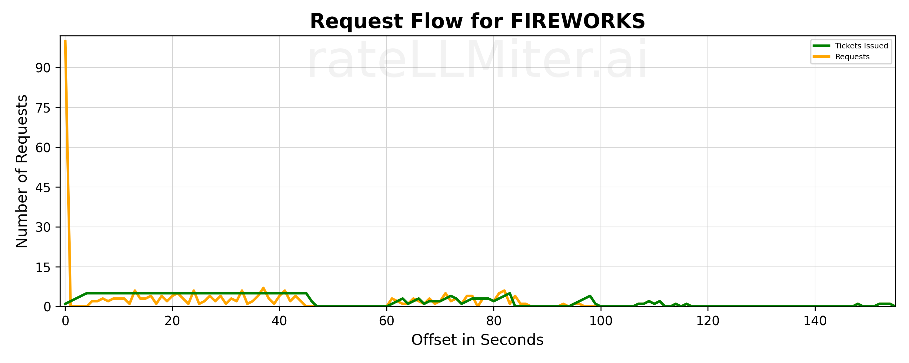

# rateLLMiter
<p align="center">
  
</p>
rateLLMiter is a Python rate limiter that smoothes out requests to LLM APIs to get faster, more consistent performance. You can
see the requests smoothing in the above graph.  The orange line represents request for a ticket to make an LLM call, the
green line is tickets issued. If a LLM client generates too many requests at once and then uses exponential backoff
to slow down requests, it is likely to get throttled to a very slow rate by the server.  rateLLMiter prevents
throttling by:

>1. Spreading out requests smoothly over an entire minute (vs making all requests at the beginning of the minute).  
>2. Ramps up requests over several seconds whenever there is a sudden increase in requests.  This prevents rate limit exceptions.
>3. After a rate limit exception, rateLLMiter periodically tests the LLM server to see if it is accepting requests again.
    When it is accepting requests, rateLLMiter releases the requests that had rate limit exceptions first.  

To use rateLLMiter, you just need to start it and use the llmiter decorator on your rate limited methods.  Behind the
scenes, rateLLMiter uses "tickets" to pace the flow of requests to the LLM server.  The decorator requests a ticket.
If no ticket is available, the requester is paused until a ticket is available.  If there is a rate limit exception after a ticket
has been issued, the ticket is returned to the rate limiter and the caller waits for a new ticket.  Rate limited requests
go to the front of the line for tickets, so they do not have to wait as long for a new ticket.  

## Installation
### Setup Virtual Environment

I recommend setting up a virtual environment to isolate Python dependencies.

```bash
python3 -m venv .venv
source .venv/bin/activate
```

### Install Package

Install the package from PyPi - this takes awhile because it also installs the python clients of multiple LLMs:

```bash
pip install ratellmiter-ai
```
### Startup and Shutdown
rateLLMiter has a monitor thread and logging that needs to be started and stopped.

```python
        get_rate_limiter_monitor().start()
        get_rate_limiter_monitor().stop()
```

Calling stop before exiting stops the monitor thread ,and it writes out logs that can be used to create graphs of the 
rate limiting. By default, logs are written to the "ratellmiter_logs" subdirectory of the current working directory. The
default rate list is 300 requests per minute.  You can change these by setting their values in the start method.

```python
        get_rate_limiter_monitor().config(default_rate_limit=300, log_directory="ratellmiter_logs")
```

### The easy way to use rateLLMiter
The easiest way to use rateLLMiter is to use the llmiter decorator.  If you are only using one LLM client, you only
need to use the decorator. You can change the default rate limit by setting the default_rate_limit parameter on startup.

```python
        @llmiter
        def get_response(prompt):
            # Your code here
```

The decorator will ask for a ticket from the rate limiter and return it to the rate limiter when the function is done.  If
there is a rate limit exception, the decorator will return the ticket to the rate limiter and wait for a new ticket.  Non
rate limit exceptions will be passed through to the caller.

### Generating graphs
Graphs are a helpful to see what rateLLMiter is doing.  You can generate graphs of the rate limiting by running the following
command in your venv:

```bash
llmiter -dir -name=? -file=? -lines=?
```

> - -dir: The directory where the log files are stored.  By default, it is "ratellmiter_logs"
> - -name: The name of the rate limited service (usually, a model name) you want to graph.  If not specified, it will use "default".
> - -file: The source file for the data to graphs.  By default, it uses the most recent log file with data.
> - -lines: The lines to draw on the graph. For example "ri" will draw the requests and issued tickets lines.  The other
  options are e=rate limit exceptions, f=finished requests, o=overflow requests

### Working with multiple LLM clients
To work with multiple LLM clients, the decorator needs to decorate a class that implements the "RateLimitedService" interface.
The methods of RateLimitService are :
```python
class RateLimitedService:
    def ratellmiter_is_llm_blocked(self) -> bool:
        # Returns True if the LLM server is still blocked after a rate limit exception.  rateLLMiter blocks all tickets
        # after a rate limit exception until the LLM server is accepting requests again. I have used a very simple prompt
        # to test this.  Something like "What is the capital of France?"  

    def get_service_name(self) -> str:
        # Returns the name of the service.  This is used for logging and graphing

    def get_ratellmiter(self, model_name:str=None) -> 'BucketRateLimiter':
        # Returns the BucketRateLimiter for this service.  OpenAI, Google etc need a rate limiter for each model. Other
        # services like Mistral and Fireworks use the same rate limiter for all models.
```

Creating a BucketRateLimiter is easy:
```python
        BucketRateLimiter(
            request_per_minute:int, 
            rate_limited_service_name:str, # this is used when you have multiple models using the same rate limiter, can be None
            rate_limited_service: RateLimitedService, # the service that is rate limited
        )
```

Send [me an email](mailto:public@llmonpy.ai) if you have any questions or suggestions.  