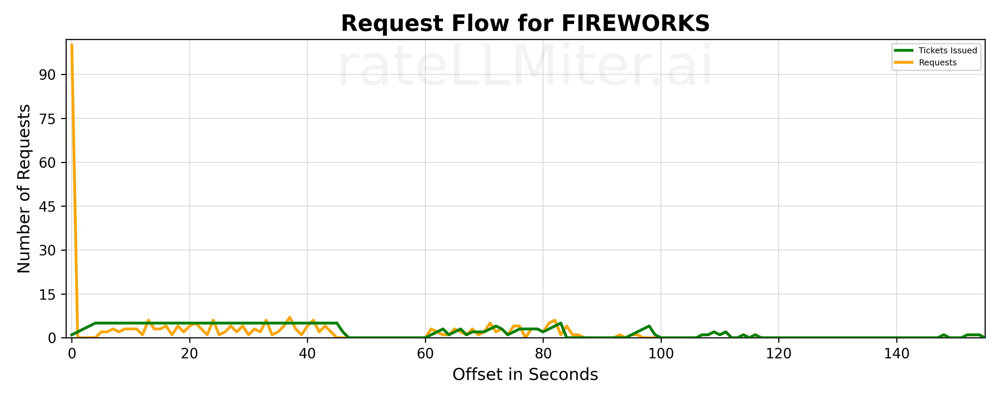

# rateLLMiter
<p align="center">
  
</p>
rateLLMiter is a Python package that smoothes out requests to LLM APIs to get faster, more consistent performance. If a
LLM client generates too many rate limit exceptions, a LLM server is likely to throttle the client. rateLLMiter prevents
throttling by:

>1. Limiting the number of requests per second to requests per minute divided by 60.  
>2. Ramps up requests over several seconds whenever there is a sudden increase in requests.  This prevents rate limit exceptions.
>3. After a rate limit exception, rateLLMiter periodically tests the LLM server to see if it is accepting requests again.
    When it is accepting requests, rateLLMiter releases the requests that had rate limit exceptions first.  

## Installation
### Setup Virtual Environment

I recommend setting up a virtual environment to isolate Python dependencies.

```bash
python3 -m venv .venv
source .venv/bin/activate
```

### Install Package

Install the package from PyPi - this takes awhile because it also installs the python clients of multiple LLMs:

```bash
pip install ratellmiter-ai
```
### Startup and Shutdown
rateLLMiter has a monitor thread and logging that needs to be started and stopped.

```python
        get_rate_limiter_monitor().start()
        get_rate_limiter_monitor().stop()
```

Calling stop before exiting stops the monitor thread ,and it writes out logs that can be used to create graphs of the 
rate limiting. By default, logs are written to the "ratellmiter_logs" subdirectory of the current working directory. The
default rate list is 300 requests per minute.  You can change these by setting their values in the start method.

```python
        get_rate_limiter_monitor().start(default_rate_limit=300, log_directory="ratellmiter_logs")
```

### The easy way to use rateLLMiter
The easiest way to use rateLLMiter is to use the ratellmiter decorator.  If you are only using one LLM client, you only
need to use the decorator. You can change the default rate limit by setting the default_rate_limit parameter on startup.

```python
        @ratellmiter
        def get_response(prompt):
            # Your code here
```

### Generating graphs
It can be helpful to see what rateLLMiter is doing.  You can generate graphs of the rate limiting by running the following
command in your venv:

```bash
ratellmiter -model=? -file=? -lines=?
```

> - -model: The name of the model you want to graph.  If not specified, it will use "default".
> - -file: The source file for the data to graphs.  By default, it uses the most recent log file with data.
> - -lines: The lines to draw on the graph. For example "ri" will draw the requests and issued tickets lines.  The other
  options are e=rate limit exceptions, f=finished requests, o=overflow requests